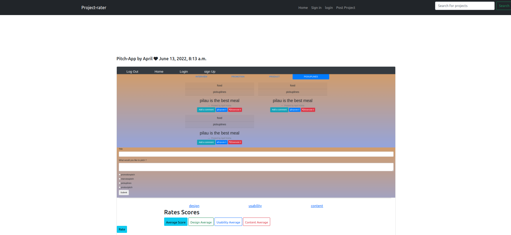

## PROJECT-RATER

## PROJECT PREVIEW

### PROJECT DESCRIPTION
This is a Django project-rater application that allows users to post a project he/she has created and get it reviewed by his/her peers.
It  is accessible to users on both desktop and mobile formats.
It has a solid authentication system that allows users to sign in or register into the application.

### :pushpin:PROJECT SETUP INSTRUCTIONS

- Open terminal {Ctrl +Alt + T}
- git clone https://github.com/Aprilwairimu/project-rater.git
- cd Project-rater
- code . or atom . depending on your text editor

### :information_desk_person: AUTHOR'S INFORMATION

Am April wairimu a young growing developer

### NAME OF CONTRIBUTORS

The project was done as an individual.

### :pushpin: TECHNOLOGY USED

The technologies are ;

:small_blue_diamond: HTML,CSS,BOOSTRAP

:small_blue_diamond:DJANGO FRAMEWORK

:small_blue_diamond: PYTHON3.9

:small_blue_diamond: DATABASE

:small_blue_diamond: HEROKU

### :telephone_receiver: CONTANCT INFORMATION

For any questions or contributions Email me at wairimuapril@gmail.

### CREATED

2022

## LICENCE AND COPYRIGHT

MIT Copyright (c) 2022 April Wairimu
